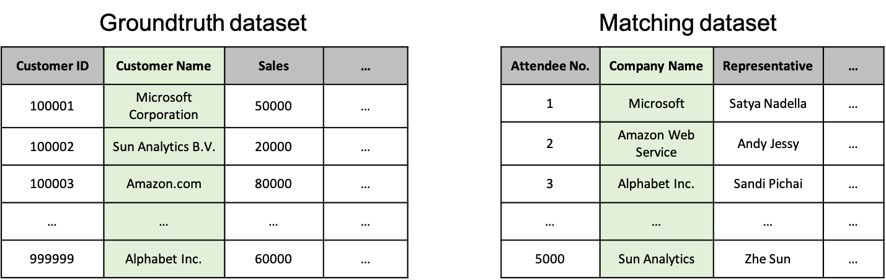
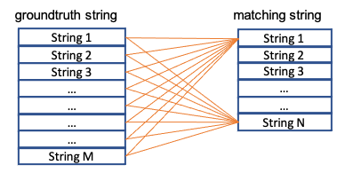

# Getting Started

## What is String Matching?
String matching is literally matching a string against a list of string, and find the most similar one(s). A string matching normally contains 2 steps:

1. Comparing strings pairwisely and compute the similarity score by a predefined similarity function
2. Decide the most similar string(s) either by using a cut-off threshold or by top K ranking most similar strings. 

Table below gives an examples. Given a string `Sun Analytics B.V.`, we want to find the most similar strings from the list `[Sun Analytics B.V., Sun Analytics BV, Sun Analytcis BV, Sun Analytics, Sun Analytics NV, Sun Analytics BV, Netherlands, Sun Microsytems Inc., Sun Anaconda Complex, Amazon.com]`. Suppose we have a predefined similarity function **_f_**, we can compute the similarity score between `Sun Analytics B.V.` and strings in the list pairwisely. 1 means exactly match for every character and position, 0 mean nothing similar. (Please be notice that the similarity score in the table is just a dummy value for demo purpose.) Then, we can decide if two strings are matched or not in two ways:

- if we select the cut-off threshold as 0.7, then we say the first 5 strings are matched
- or we rank the strings by the similarity score, and select the top 3 ones

| row No. | string A  | string B  | Explanation  | Similarity score (**_f(stringA, string B)_**)  | Match by threshold = 0.7  | Match by top 3  |
|---|---|---|---|---|---|---|
| 1 | Sun Analytics B.V.  | Sun Analytics B.V.  | Exact match  | 1  | Yes  | Yes  |
| 2 | Sun Analytics B.V.  | Sun Analytics BV  | Close, only two punctuation difference  |  0.9 | Yes | Yes  |
| 3 | Sun Analytics B.V.  | Sun Analyt**ci**s BV  | Close, most probabaly a typo of "Analytics"  | 0.8  |Yes  | Yes  |
| 4 | Sun Analytics B.V.  | Sun Analytics  | Close, company legal form is removed  | 0.7  | Yes  | No  |
| 5 | Sun Analytics B.V.  | Sun Analytics NV  | Close, different type of company legal name | 0.7  |  Yes | No  |
| 6 | Sun Analytics B.V.  | Sun Analytics BV, Netherlands  | Close, a country name is appended  | 0.6  | No  |  No  |
| 7 | Sun Analytics B.V.  | Sun Microsytems Inc.  | One token is the same, but should be two totally different entity | 0.3  | No | No  |
| 8 | Sun Analytics B.V.  | Sun Anaconda Complex  | Some sub-token overlapping  | 0.1  |  No | No  |
| 9 | Sun Analytics B.V.  | Amazon.com  | no similar token or sub-token | 0  |  No | No  |

## Why We Need String Matching?
String matching is useful when we want to link entities while there is no unique key to do the exact match. The figure below shows an example. 

Suppose you are a business analyst in marketing department. Your company has an internal customer relationship management (CRM) dataset which contains the basic information of 1 million customers of your company. Let us call it **_groundtruth dataset_**. Now, you collect another dataset from a marketing event with around 5000 participants, and we call it **_matching dataset_**. You task is linking the matching dataset with groundtruth dataset, so that you can do more analysis on the event participants based on your customer relationship management data. Since there is no unique key to do the dataset SQL joining, you have to link the two dataset by `Customer Name` column in groundtruth dataset and `Company Name` column in matching dataset by the string similarity.

Company names, person names, address and other text are vitally important data points in different industries such as financial compliance, anti-fraud, government intelligence, law enforcement, and identity verification. So, string matching can be helpful in different scenarios in different industries. For example:

- Cyber-security department in banking: banks is obliged to monitor the names on all transactions to see if these match with international watch lists. String matching can be used to analyzed the transaction name and link the party in a transaction with the international watch lists
- Supply chain department in Fast-moving consumer goods industry: match external dataset with internal customer data
- Data management department in Geo Information industry: address of point of interest have different way of representation in different data source. String matching can help data aggregation.

## Two Types of String Matching Task
### Batch string matching task
Batch string matching task matches two datasets. As the figure below, two datasets are given: the groundtruth dataset with M strings and the matching dataset with N strings. For each record of the matching dataset, we want to find the most similar k records from the groundtruth dataset. The task will take a relative long computation time.

  

### Real-time string matching task
Real-time string matching task matches a small amount of strings and return the result in real-time. In this scenario, the user have a large groundtruth dataset, and have on-demand query requests to match a small amount (several to dozens) strings. The user wants (near) real-time matching result.

## Why string matching is difficult?
String matching is a complicated problem mainly in two aspects, i.e., **_similarity score computation_** and **_computational complexity_**.

### Similarity score computation
Similarity itself is natually ill-defined. it can be challenging to match names when your data includes variables such as misspellings, aliases or nicknames, initials, sequence and non-Latin scripts. Here we list some common scenarios which will be considered as similar strings. For different industries, the scenarios below also weights differently. For example, when the dataset is manually input, misspelling may happen more frequently, while in business reports, legal form related company name variants are more common than other documents. It is difficult to have a similarity function to cover all the scenarios, and **we need a configurable similarity computation to adapt different dataset**.

- **Initial abbrevation**: GlaxoSmithKline  vs. GSK
- **Short name**: Amsterdam vs. AMS
- **Word sequence**: Zhe Sun vs. Sun Zhe
- **Misspelling**: environment vs. enviroment
- **Space, dash**: ABN AMRO vs. ABN-AMRO
- **Company legal form**: ABN AMRO NV vs. ABN AMRO BV

### Computational complexity
String matcing has high computational complexity. First, string matching does pairwise similarity computation. Suppose we have M strings in groundtruth dataset, and N strings in matching dataset. The total similarity computation is _N*M_ times. In some industries, _N_ and/or _M_ could be millions. Besides, the simiarity score computation between two strings could be very computational intensive in some scenarios, for example, if we want to catch misspelling or legal form variants. **We need to have a highly efficient string matching algorithm**. Otherwise, the string matching will be a never-end computation tasks[1](#myfootnote1).

## String-Matching-as-a-Service (SMaaS)
Our solution provides a String-Matching-as-a-Service. User can login our website, use the string matching by a web-based user interface or via API. The features of our SMaaS are:

- **Ready-to-go solution for developer and business people**: save development time for an in-house solution, and help time-to-market
- **Accurate result**: different scenarios have different way of string matching. we can adapt our computation method on your usage 
- **Optimized algorithm**: we optmize our algorithm to achieve the fastest computation
- **Cost and speed trade-off**: we provide flexible configuration. You can choose fast but more expensive solution, or slow but costly solution. It is all controled by you on your usage scenario
- **Security**: you can deploy the solution on your account. All data encrypted in transit and at rest. 
- **GDPR compliance**:this application is GDPR compliance. We provide data retention (what else), able to delete customer data?

### Local Version
User can also deploy our product on their local laptop, and run string matching. It is a testing solution with limited functionality such as limitation on number of tasks.

### Deploy on Enterprise Cloud Environment
We can also deploy our service in an enterprise cloud environment. Currently, we support AWS. Next, we will support Azure.

--------------------------------------

<a name="myfootnote1">1</a>: For example, we want to match a 1 million strings groundtruth dataset by a 100K strings matching dataset, and one string pairs takes 1us (which is already extremly fast!), then the total computation time is _1M\*100K\*0.000001s_=100K second=27 hours!