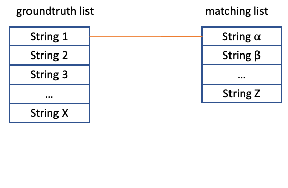
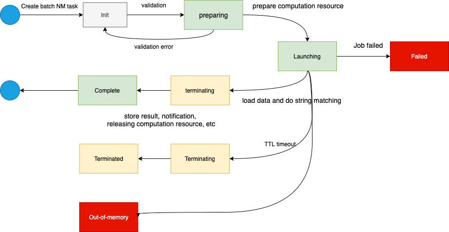
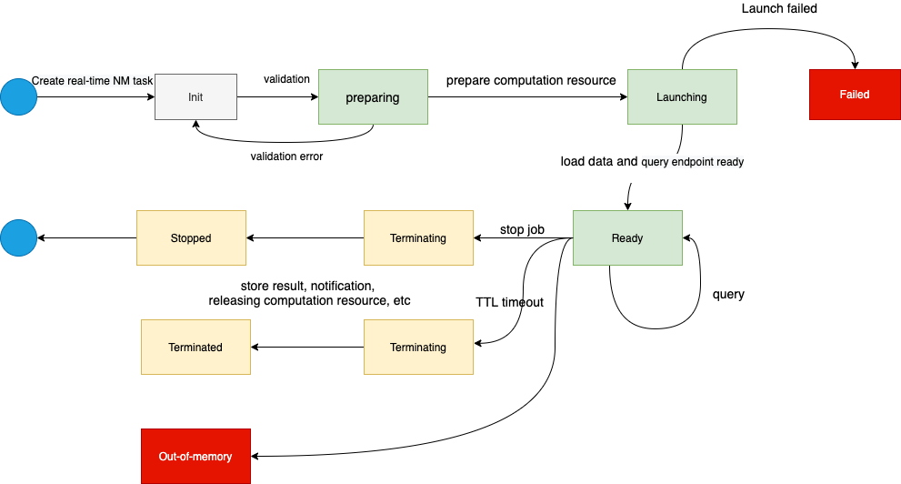
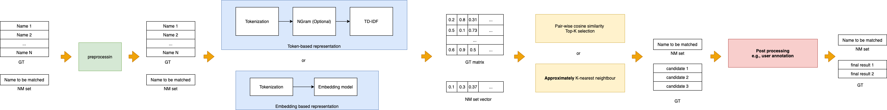

# Terminology

## String matching
String matching is literally matching a string against a list of string, and find the most similar one(s). This [section](index.md#what-is-string-matching) gives an example of string matching. String matching is useful when we want to link entities while there is no unique key to do the exact match.

String matching finds the most similar string from `groundtruth list` for every string in the `matching list`. The execution of string matching are explained and illustrated as below.it.

1. Iterate the every string in the `matching string list`
2. Compare the string _X_ with every string _Y_ in the `groundtruth string list` pairwisely, and use a predefined similarity function _f_ to compute the similarity score _f(X, Y)_
3. Decide the most similar string(s) either by using a [cut-off threshold](#) or by [top K](#) ranking most similar strings. 

## Matching list
Matching list is a list of string which we want to find the most similar string form gorundtruth list. A matching list can be treated a lookup string.

## Groundtruth list
Groundtruth list is a list of string where the most similar string comes from. Groundtruth list can be treated as a dictionary string.

## Similarity score
Similarity score measures how similar two strings are. If two string are exactly the same, the similarity score is 1. If two string are totally different, the similarity score is 0. 

There are different way to compute the similarity scores. Different algorithm will give different scores.

## Dataset
A dataset is a 2-dimensional plain text table. It is the basic data element used for string matching task. You can create a dataset in the `Dashboard/Dataset/Create Dataset` page. Currently, we support creating a dataset by a uploaded CSV file and Excel file.

A dataset contains dataset header and dataset body. Below is an example of a dataset.

- **dataset header**: it contains a array of strings assigned to each of the columns. The first row of the uploaded CSV or Excel file will be used as the dataset header. In the example below, the headers are `Customer ID`, `Customer Name` and `Sales`.
- **dataset body**: the dataset body contains multiple columns. Each columns should be unified type of data, such as string, number of a date time. The corresponding header is the description of the column. In the example below, the type of `Customer ID` column is integer, the type of `Customer Name` column is string, and the type of `Sales` columns is float.

| Customer ID  | Customer Name  | Sales  |
|---|---|---|
| 100001  | Microsoft Corporation  | 50000  |
| 100002  | Amazon.com  | 60000  |
| 100003  | Sun Analytics B.V.  | 20000  |

## Groundtruth dataset
Groundtruth dataset is a dataset contains the groundtruth list. Normally, the groundtruth dataset is from the internal data, or we treat it as the groundtruth. Besides of the groundtruth list column, groundtruth dataset also contains other columns, which can be appended as the matching result.

## Matching dataset
Matching dataset is a dataset contains the matching list. Normally, matching dataset is an external dataset, which we want to link it with the groundtruth dataset.

## Match key
Match key is one (or more) column(s) in the dataset. It is used for the matching computation in real-time matching or batch string matching task.

## String matching task
A string matching task is a computation job which does the string matching. String matching is a complicated task from the aspects of both similarity complexity and computational complexity. Our String-Matching-as-a-Service product provides you a ready-to-go, accurate, fast and secure way to do the string matching on your local or cloud environment. We support two kinds of tasks [batch string matching task](#batch-string-matching-task) and [real-time string matching task](#real-time-string-matching-task) on the dashboard.

A string matching task can be created by an authenticated user. The autheticated user is the owner of the task. An owner can edit and delete the tasks he/she created. 

## Batch string matching task
Batch string matching task is suitable for the scenario of matching a large matching dataset. Suppose we receive an external dataset with hundreds of thousands rows. We want to use the "name" column to match the "customer name" column in an internal dataset. We call the external dataset as `matching dataset`, and the internal dataset as `groundtruth dataset`. Then, we can create a batch string matching task to match the two datasets. Our product will load the batch task configuration, initiate the computation resource, load the groundtruth dataset and matching dataset, and run the efficient algorithm to match the two dataset, and prepare the matching result for downloading. The computation resource will be destroyed when the matching task is finished.

The matching will take relative long time. We can check the task status to check if the task has finished.

## Real-time string matching task
Real-time string matching task is suitable for the scenario of matching a small amount (several to dozens) of strings with the groundtruth dataset and getting the matching result in near real-time (seconds). 

Under the hood, our product will load the task configuration, initiate the computation resource, load the groudntruth dataset, and keep the computation resource running and ready for matching query. When a user makes a query, the computation is triggered and return the result in near real-time. The computation resource will only be destroyed when the real-time string matching task is terminated by the user.

## Name and Description
When creating a dataset or a string matching task, name is needed to distinguish with your other dataset or string matching task. The character of name is also required as only from alphebat, number, hypen (-) and underscore (_).

Description is optional. It helps you to note down the information you want to attach to the dataset or task.

## Matching options
You can control the matching result by manipulate the matching options. Currently, `Number of matching result`, `similarity threshold` and `columns as matching result` can be configured as explained as the example below and also in the following section.

Given `Groundtruth dataset` with `matching key` is `Customer Name`

| row No. | Customer ID | Customer Name | Sales  |
|---|---|---|---|
| 0 | 100001 | Microsoft Corporation | 50000  |
| 1 | 100002 | Sun Analytics B.V. | 20000  |
| 2 | 100003 | Amazon.com | 80000  |
| 3 | 100004 | Microsoft the Netherlands B.V. | 10000  |
| 4 | 100005 | Amazon EU SARL | 60000  |
| 5 | 100006 | Amazon.nl | 30000  |

and `Matching dataset` with `matching key` is `Company Name`

| Attendee No.| Company Name | Representative  |
|---|---|---|
| 1 | Microsoft | Satya Nadella  |
| 2 | Amazon Web Service | Andy Jessy  |
| 3 | Sun Analytics | Zhe Sun  |

After a pairwise similarity computation, we have the matching candidates ranking by the similarity scores between `Company Name` and `Customer Name`.

| Company Name | Row No. of GT dataset  | Customer Name | similarity score |
|---|---|---|---|
| Microsoft | 0 | Microsoft Corporation | 0.8 |
| Microsoft | 3 | Microsoft the Netherlands B.V. | 0.6 |
| Microsoft | 4 | Amazon EU SARL | 0 |
| Microsoft | 5 | Amazon.nl | 0 |
| Microsoft | 2 | Amazon.com | 0 |
| Microsoft | 1 | Sun Analytics B.V. | 0 |
| Amazon Web Service | 5 | Amazon.nl | 0.65 |
| Amazon Web Service | 2 | Amazon.com | 0.63 |
| Amazon Web Service | 4 | Amazon EU SARL | 0.6 |
| Amazon Web Service | 0 | Microsoft Corporation | 0 |
| Amazon Web Service | 3 | Microsoft the Netherlands B.V. | 0|
| Amazon Web Service | 1 | Sun Analytics B.V. | 0 |
| Sun Analytics | 1 | Sun Analytics B.V. | 0.9 |
| Sun Analytics | 0 | Microsoft Corporation | 0 |
| Sun Analytics | 2 | Amazon.com | 0 |
| Sun Analytics | 3 | Microsoft the Netherlands B.V. | 0|
| Sun Analytics | 4 | Amazon EU SARL | 0 |
| Sun Analytics | 5 | Amazon.nl | 0 |

Then, the `similarity threshold` option decides which pairs are regarded as a match. Suppose `similarity threshold = 0.65`, we have these 4 rows remaining as matching result.

| Company Name | row No.  | Customer Name | similarity score |
|---|---|---|---|
| Microsoft | 0  | Microsoft Corporation | 0.8 |
| Amazon Web Service | 5  | Amazon.nl | 0.65 |
| Amazon Web Service | 2  | Amazon.com | 0.65 |
| Sun Analytics | 1  | Sun Analytics B.V. | 0.9 |

Next, `number of matching result` decides the top `N` result. If `number of matching result` is 2, the matching result is the table above. If `number of matching result` is 1, the matching result is below

| Company Name | row No.  | Customer Name | similarity score |
|---|---|---|---|
| Microsoft | 0  | Microsoft Corporation | 0.8 |
| Amazon Web Service | 5  | Amazon.nl | 0.65 |
| Sun Analytics | 1  | Sun Analytics B.V. | 0.9 |

Last, `Columns as matching result` decides which columns from groundtruth dataset will be used as the final matching results. Suppose `Columns as matching result` is `[Customer ID, Sales]`, the final matching result will be

| Company Name | row No.  | Customer Name | similarity score | Customer ID | Sales |
|---|---|---|---|---|---|
| Microsoft | 0  | Microsoft Corporation | 0.8 | 100001 | 50000 |
| Amazon Web Service | 5  | Amazon.nl | 0.65 | 100006 | 30000 |
| Amazon Web Service | 2  | Amazon.com | 0.65 | 100003 | 80000 |
| Sun Analytics | 1  | Sun Analytics B.V. | 0.9 | 100002 | 20000 |

### Number of matching result
When do a string matching, you can control how many matching results you want to return.

When the value is `N`, the algorithm finds the most `N` similar string which similarity scores are greater than the similarity threshold. If the algorithm cannot find `N` results, it will result None as a placeholder.

### Similarity threshold
Only the similarity score is greater than the similarity threshold can be regarded as a match.

### Columns as matching result
After the matching, you can select columns as the matching result.

## Computation resource
Computation resource needs to be assigned on each string matching task. We provide a list of computation resource options for you to select a suitable one  according to your string matching complexity.

### T-shirt size
Currently, we provide a list of computation resource options as the table below:

| T-shirt size | Nr. CPU  | Memery Size |
|---|---|---|
| Small | 0.25  | 64 MB |
| Medium | 1  | 256 MB |
| Large | 2  | 1024 MB |

**For free user, only small type is supported.** However, for enterprise users, there is no limitation. More customize resource can be requested and added as resource options.

<!-- ### Computation type
Currently, we only support multi-thread computation. In future, we may add Apache Spark as the computation type. -->

### Maximal running time
A string matching task maximal running time can be configured when creating the task. When the total running time reach the configured value, the string matching task will be terminated automatically. The task status will change to `terminated`.

If a batch task is still in running stage, the matching procedure will be stopped and the result will be discarded.

**For free user, the maximal running time is not changable. It is 15 minutes for a batch task, and 1 hour for a real-time task.**

However, for a enterprise users, the maximal running time can be changed. The user can set up the value according to the expected task running time to save the computation cost.

## Advanced algorithm options
As we mentioned in [this section](/#similarity-score-computation), we need a flexible and configurable solution for string matching similarity score computation. We provides advanced algorithm options to adapt the algorithm with your dataset.

### Preprocessing options
#### Case sensitive
Lower the string to lowercase letter in preprocessing step, so that the string matching is case insensitive

#### Company legal form normalization
A company legal form (or a business entity) is an entity that is formed and administered as per corporate law. There are many types of business entities defined in the legal systems of various countries. These include corporations, cooperatives, partnerships, sole traders, limited liability companies and other specifically permitted and labelled types of entities. For example, the legal form of business and its abbreviations are:

- in the Netherlands
    - Sole proprietorship: the Dutch eenmanszaak
    - General or commercial partnership: the vennootschap onder firma (vof)
    - Professional or public partnership: the maatschap
    - Limited partnership: the commanditaire vennootschap (cv)
    - Private limited company: the besloten vennootschap (bv)
    - Public limited company: the naamloze vennootschap (nv)
- in UK
    - Limited liability partnership (LLP)
    - Scottish limited partnership (SLP)
    - Limited partnership (LP)
    - Private Limited Companies (Ltd)
    - Public Limited Company (PLC)
    - Sole proprietorship (Sole traders)

The abbreviation of legal form can be written in different format. For example, Private limited company B.V. in the Netherlands can be written down as `B. V.` or  `B.V.` or `B V`, or  `BV`.

This preprocessing step is normalizing the company legal form abbreviation.

#### Initial abbreviations
Initial letter is used sometimes in person names and company names, for example, J.K. Rowling or KPN for Koninklijke PTT Nederland. This preprocessing extracts the initials from each word

#### Remove punctuation
This preprocessing removes punctuation。

#### Normalize accent character
Some language has latin characters such as Ä, Â, Ă, etc. This preprocessing normalize the character and remove the accent character to English letter, such as chagne Ä to A

#### Shorthand format processing
Map all the shorthands to the same format, such as stichting to stg. in Dutch

### Algorithm type
We provide two types of different algorithm types, `Vector-based algorithm` and `Levenshtein distance based algorithm`.
 
#### Vector-based algorithm
Vector-based algorithm is illustrated as the diagram below. Each string can be converted to a vector (a numeric array) to represent the string. Then, a list of string in the groundtruth list or matching list can be as a matrix. Next, a similarity score can be computed and the matching result is generated. 

##### Tokenizer option
Tokenization is the process of demarcating and possibly classifying sections of a string. When select vector-based algorithm, we can also decide the tokenization option by either `word` or `subword`.
- word tokenization: a string is demarcating into tokens natually by word. Space, puncturation and other non-alphbet number characters can be separators.
- subword tokenization: besides separated by word, tokens are separated even inside a word. There are different way of subword tokenization. We support `N-char`, which treats every n character as a token. 
  
The table below give some examples of word tokenization and subword tokenization.

| String | Word tokenizer  | Subword tokenizer (3-characters) |
|---|---|---|
| Sun Analytics BV | [Sun, Analytics, BV]  | [Sun, Ana, nal, aly, lyt, yti, tic, ics, BV] |

##### Vector similarity
After generating the vector, similarity can be computed. We provides two options `Exact matching` and `approximate matching`

- Exact matching: the simiarity is do the pairwise computation and find the exact closet string as matching result
- Approximate matching: the algorithm can cluster the vectors first, and first the approximately close match.

#### Levenshtein distance based algorithm
the Levenshtein distance is a string metric for measuring the difference between two sequences. Informally, the Levenshtein distance between two words is the minimum number of single-character edits (insertions, deletions or substitutions) required to change one word into the other. In string matching, edit distance is useful especially when misspeling or missing a character happens in the string.

However, Levenshtein distance is a computational intensive. Suppose it takes 10ms to compute the Levenshtein distance of two strings, and if we have a relative large dataset with 100,000 rows in [groundtruth dataset](/terminology/#groundtruth-dataset), matching one string with the groundtruth dataset will take 16 minutes!

<!-- ## Vistor
If you have not signed up, you are visiting the product in vistor mode. You are not allowed to access dashboard and use the string matching functionalities this product provides -->

## User
For a signed up user, after you log in, you can access the dashboard, and able to use these functionalities via a web UI or development API.

<!-- ## Organization
The maximal visible scope for a NM task. For example, one enterprise customers could be an organization.
A group can only belong to one organization. A user can only belong to one organization. -->

